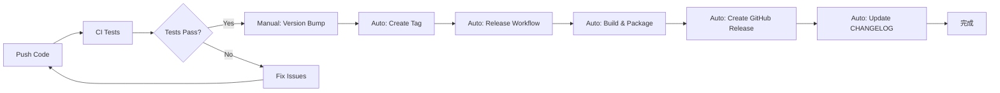

# GitHub Actions Workflows

本專案使用 GitHub Actions 自動化以下流程：

## 🚀 自動化工作流程

### 1. **CI (持續整合)** - `ci.yml`
- **觸發時機**：每次 push 到 main 或開啟 PR
- **功能**：
  - 多版本 Node.js 測試 (16.x, 18.x, 20.x)
  - 編譯 TypeScript
  - 執行 linter
  - 打包擴展
  - PR 自動生成 changelog 預覽

### 2. **自動發布** - `release.yml`
- **觸發時機**：推送版本標籤 (v*.*.*)
- **功能**：
  - 自動編譯和打包
  - 生成 Release Notes
  - 創建 GitHub Release
  - 上傳 VSIX 檔案

### 3. **更新 CHANGELOG** - `update-changelog.yml`
- **觸發時機**：發布新版本或手動觸發
- **功能**：
  - 自動生成 CHANGELOG.md
  - 基於 commit 訊息分類
  - 創建 PR 更新 CHANGELOG

### 4. **版本管理** - `version-bump.yml`
- **觸發時機**：手動觸發
- **功能**：
  - 自動升級版本號 (major/minor/patch)
  - 更新 package.json
  - 創建版本標籤
  - 觸發發布流程

## 📝 使用方法

### 發布新版本的完整流程：

```bash
# 1. 提交你的變更
git add .
git commit -m "feat: 新增功能描述"
git push

# 2. 使用 GitHub Actions 升級版本
# 前往 Actions > Version Bump > Run workflow
# 選擇版本類型 (patch/minor/major)

# 3. 自動觸發：
# - 創建新標籤
# - 觸發 Release workflow
# - 生成 Release Notes
# - 打包並上傳 VSIX
# - 更新 CHANGELOG.md
```

### 手動發布：

```bash
# 1. 更新版本
npm version patch  # 或 minor/major

# 2. 推送標籤
git push --tags

# 3. GitHub Actions 會自動處理剩餘流程
```

## 🏷️ Commit 訊息規範

為了自動生成正確的 CHANGELOG，請使用以下格式：

- `feat:` 新功能
- `fix:` Bug 修復
- `docs:` 文檔更新
- `chore:` 維護性工作
- `refactor:` 重構
- `perf:` 性能優化
- `test:` 測試相關
- `style:` 程式碼風格

**Breaking Changes**：
```bash
feat!: 破壞性變更描述

BREAKING CHANGE: 詳細說明
```

## 🔑 必要的 Secrets

在 GitHub Repository Settings > Secrets 中設定：

1. **GITHUB_TOKEN** (自動提供)
2. **VSCE_TOKEN** (可選，用於發布到 VSCode Marketplace)
   ```bash
   # 獲取 token：
   vsce create-publisher <publisher-name>
   vsce login <publisher-name>
   vsce generate-pat
   ```

## 📊 工作流程圖



## 🔧 自定義配置

### changelog-config.json
控制 Release Notes 的生成格式和分類。

### cliff.toml
使用 git-cliff 生成更詳細的 CHANGELOG（備選方案）。

## 📚 相關文檔

- [GitHub Actions 文檔](https://docs.github.com/en/actions)
- [Conventional Commits](https://www.conventionalcommits.org/)
- [Keep a Changelog](https://keepachangelog.com/)
- [Semantic Versioning](https://semver.org/)
