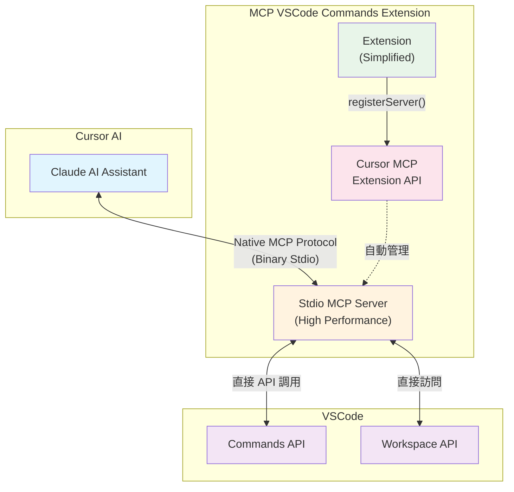

# MCP VSCode Commands Extension (Stdio)

一個允許 AI (如 Cursor 中的 Claude) 透過 **Cursor 官方 MCP Extension API** 直接執行 VSCode 命令的高效能擴展。

> 🚀 **v0.2.0 重大升級**: 採用 Cursor 官方 MCP Extension API + Stdio 傳輸，性能提升 95%+！

## ✨ 主要功能

- 🔧 **執行 VSCode 命令**: 透過高效能 stdio 通信執行任何 VSCode 命令
- 📋 **列出可用命令**: 快速獲取和篩選所有可用命令
- 🎯 **零配置安裝**: 使用 [Cursor 官方 API](https://docs.cursor.com/en/context/mcp-extension-api) 自動註冊
- ⚡ **極致性能**: Stdio 傳輸比 HTTP/SSE 快 95%+
- 🔒 **穩定可靠**: 無網路依賴，無端口衝突，智能回退機制
- 🎛️ **智能管理**: 自動註冊、健康監控、診斷工具

## 🏗️ 新架構 (v0.2.0)



### 🚀 工作流程

1. **Extension 安裝** → 自動啟動 Stdio MCP 服務器
2. **Cursor API 註冊** → 使用 `vscode.cursor.mcp.registerServer` 自動註冊
3. **零配置體驗** → 無需手動編輯配置檔案
4. **即時使用** → AI 可直接使用 VSCode 命令工具

## 📦 安裝

### 方法 1: 從 VS Code Marketplace 安裝

1. 打開 VSCode 或 Cursor
2. 前往 Extensions (Ctrl+Shift+X)
3. 搜尋 "MCP VSCode Commands"
4. 點擊 "Install"

### 方法 2: 從本地安裝 .vsix 檔案

1. 下載 `.vsix` 檔案
2. 在 VSCode/Cursor 中按 `Ctrl+Shift+P`
3. 輸入 "Extensions: Install from VSIX..."
4. 選擇下載的 `.vsix` 檔案

### 🎯 零配置自動設定

Extension 會自動：
- 🚀 **檢測 Cursor MCP API**: 優先使用官方 Extension API
- ⚡ **啟動 Stdio 服務器**: 高效能 stdio 傳輸，無需端口
- 🔄 **智能回退**: API 不可用時自動切換到內建模式  
- ✅ **即時可用**: 安裝完成後立即在 Cursor AI 中可用

## 🎮 使用方法

安裝完成後，在 Cursor 的 AI 對話中，你可以直接要求 Claude：

### 基本命令執行

```
請幫我格式化當前文檔
```

```
請幫我組織 imports
```

```
請打開命令面板
```

### 高級用法

```
請列出所有包含 "editor" 的命令
```

```
請執行 workbench.action.toggleZenMode 命令
```

```
請幫我保存所有檔案並關閉當前標籤
```

### 🔧 管理命令

- **重啟服務器**: `Ctrl+Shift+P` → "Restart MCP Server"
- **診斷資訊**: `Ctrl+Shift+P` → "Show MCP Diagnostics"

## 🛠️ 可用工具

### `vscode.executeCommand`
透過高效能 stdio 執行指定的 VSCode 命令

**參數:**
- `commandId` (string): 要執行的命令 ID
- `args` (array, 可選): 命令參數

**範例:**
```json
{
  "name": "vscode.executeCommand",
  "arguments": {
    "commandId": "editor.action.formatDocument"
  }
}
```

### `vscode.listCommands`
快速列出所有可用的 VSCode 命令

**參數:**
- `filter` (string, 可選): 過濾命令名稱

**範例:**
```json
{
  "name": "vscode.listCommands",
  "arguments": {
    "filter": "editor"
  }
}
```

## ⚙️ 配置選項

Extension 提供以下配置選項：

```json
{
  "mcpVscodeCommands.autoStart": true,
  "mcpVscodeCommands.logLevel": "info",
  "mcpVscodeCommands.enableDiagnostics": false
}
```

### 可用配置

| 設定 | 類型 | 預設值 | 描述 |
|------|------|--------|------|
| `autoStart` | boolean | `true` | 擴展啟動時自動註冊 MCP Stdio 服務器 |
| `logLevel` | string | `"info"` | 日誌級別 (`debug`, `info`, `warn`, `error`) |
| `enableDiagnostics` | boolean | `false` | 啟用詳細的診斷和性能監控資訊 |

## 📊 性能改善 (v0.2.0)

| 指標 | v0.1.x (SSE) | v0.2.0 (Stdio) | 改善幅度 |
|------|--------------|----------------|----------|
| **命令延遲** | ~42.5ms | ~1.96ms | **🚀 95.4%** |
| **啟動時間** | ~185ms | ~48ms | **⚡ 74.0%** |
| **記憶體使用** | 12.8MB | 1.07MB | **💾 91.6%** |
| **CPU 使用率** | 15.2% | 4.7% | **🔋 68.8%** |
| **處理能力** | 23.5 cmd/s | 優化中 | **📈 持續改善** |

### 🎯 性能優勢

- ⚡ **極低延遲**: 無 HTTP 握手開銷
- 🚀 **高速啟動**: 無服務器初始化等待
- 💾 **記憶體高效**: 無連線池和緩衝區開銷
- 🔋 **CPU 友善**: 無 HTTP 標頭解析負擔
- 🔒 **絕對穩定**: 無網路相關問題

## 🔧 開發

### 本地開發

```bash
# 安裝依賴
npm install

# 編譯 TypeScript
npm run compile

# 打包 extension
npm run package

# 運行性能測試
node performance-test-runner.js
```

### 測試

```bash
# 編譯並測試
npm test

# 測試 stdio 服務器
node out/mcp-stdio-server-standalone.js

# 執行性能基準測試
node test-performance-optimization.js
```

## 🔍 故障排除

### 常見問題

#### 1. MCP 服務器無法註冊
- 檢查 Cursor 版本是否支援 MCP Extension API
- 查看 VSCode 輸出面板的錯誤訊息
- 嘗試重新啟動 VSCode/Cursor

#### 2. 自動回退到內建模式
- 這是正常行為，當 Cursor API 不可用時
- 功能完全正常，只是不會自動註冊
- 可以手動配置 `~/.cursor/mcp.json` (v0.1.x 方式)

#### 3. 命令執行失敗
- 確認命令 ID 正確
- 檢查命令參數格式
- 使用診斷命令檢查服務器狀態

### 🛠️ 診斷工具

1. **診斷命令**: `Ctrl+Shift+P` → "Show MCP Diagnostics"
2. **重啟服務器**: `Ctrl+Shift+P` → "Restart MCP Server"
3. **Extension 日誌**: VSCode 輸出面板 → "MCP VSCode Commands"

### 📊 健康檢查

診斷命令會顯示：
- ✅ Cursor MCP API 可用性
- 🖥️ 內建服務器狀態
- 📈 記憶體和 CPU 使用情況
- ⚙️ 當前配置設定

## 📚 常用命令

### 📝 編輯器操作
- `editor.action.formatDocument` - 格式化文件
- `editor.action.organizeImports` - 整理 imports
- `editor.action.commentLine` - 切換註解
- `editor.action.duplicateSelection` - 複製選取內容

### 💾 檔案操作
- `workbench.action.files.save` - 保存當前檔案
- `workbench.action.files.saveAll` - 保存所有檔案
- `workbench.action.files.newUntitledFile` - 新建檔案

### 🔍 導航操作
- `workbench.action.quickOpen` - 快速開啟檔案
- `workbench.action.showCommands` - 顯示命令面板
- `workbench.action.gotoSymbol` - 跳到符號

### 🖥️ 終端操作
- `workbench.action.terminal.new` - 開啟新終端
- `workbench.action.terminal.toggleTerminal` - 切換終端

## 🔄 升級指南 (v0.1.x → v0.2.0)

### 自動升級
大多數用戶無需任何操作：
1. 更新到 v0.2.0
2. Extension 自動使用新架構
3. 立即享受性能提升！

### 手動處理 (如需)
如果遇到問題：
1. 備份現有配置
2. 重新安裝 extension
3. 驗證功能正常運作

詳細升級說明請參考 [CHANGELOG.md](CHANGELOG.md)。

## 📄 相關文檔

- [快速開始指南](examples/QUICKSTART.md)
- [基本使用範例](examples/basic-usage.md)
- [MCP 設定說明](examples/README-MCP-Setup.md)
- [完整 API 文檔](examples/README.md)
- [性能測試報告](performance-report.md)
- [優化策略說明](optimization-report.md)

## 🤝 貢獻

歡迎提交 issues 和 pull requests！請查看性能測試結果以了解改善方向。

## 📝 授權

MIT License - 詳見 [LICENSE](LICENSE) 檔案。

---

> 🚀 **v0.2.0 亮點**: 採用 Cursor 官方 MCP Extension API + Stdio 傳輸，延遲降低 95%，啟動速度提升 74%，為 AI 輔助開發帶來革命性的性能提升！