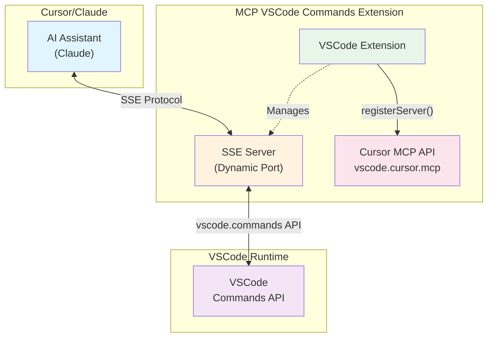

# MCP VSCode Commands Extension

一個允許 AI (如 Cursor 中的 Claude) 透過 **Model Context Protocol (SSE)** 直接執行 VSCode 命令的擴展。

> 🔧 **穩定版本**: 使用成熟的 SSE (Server-Sent Events) 架構，提供可靠的 MCP 服務！

## ✨ 主要功能

- 🔧 **執行 VSCode 命令**: 透過 MCP 執行任何 VSCode 內建或擴展命令
- 📋 **列出可用命令**: 動態獲取所有可用命令並支援過濾
- 🎯 **自動配置**: 自動管理 Cursor MCP 配置，安裝即用
- 🏗️ **SSE 架構**: 使用穩定的 Server-Sent Events 傳輸
- 🔒 **安全執行**: 完整錯誤處理和結果序列化
- 🚀 **動態端口**: 自動分配可用端口，避免衝突

## 🏗️ 架構



### 🚀 工作流程

1. **Extension 安裝** → 自動啟動 SSE MCP 服務器
2. **Cursor API 註冊** → 使用 `vscode.cursor.mcp.registerServer` 自動註冊
3. **零配置體驗** → 無需手動編輯配置檔案
4. **即時使用** → AI 可直接使用 VSCode 命令工具

## 🛠️ MCP 工具

### `vscode.executeCommand`
執行指定的 VSCode 命令
- **參數**: `commandId` (必需), `args` (可選)
- **範例**: 格式化文件、開啟設定、保存檔案等

### `vscode.listCommands`  
列出所有可用的 VSCode 命令
- **參數**: `filter` (可選) - 過濾字串
- **回傳**: 過濾後的命令列表

## 📦 安裝與使用

### 🎯 快速開始 (零配置!)


### 📋 安裝步驟

#### 方法 1: 從 VS Code Marketplace (推薦)
1. 開啟 VS Code 或 Cursor
2. 前往擴展頁面 (`Ctrl/Cmd + Shift + X`)
3. 搜尋 "MCP VSCode Commands"
4. 點擊安裝 - **完成！**

#### 方法 2: 從原始碼安裝
```bash
# 1. 克隆並安裝依賴
git clone https://github.com/louisfghbvc/mcp-vscode-commands.git
cd mcp-vscode-commands
npm install

# 2. 編譯和打包
npm run compile
npx vsce package

# 3. 安裝 VSIX 檔案
# 在 VS Code 中：Extensions → "..." → "Install from VSIX..."
```

### 🎉 使用 (零配置!)

安裝後：
1. **重新啟動 Cursor** (如果需要)
2. **立即可用** - MCP 服務器已自動註冊到 VS Code
3. **開始使用** - AI 現在可以使用 VSCode 命令工具了！

### 📊 管理 MCP 服務器

在 VS Code Extensions 視圖中，您可以：
- ✅ **啟動/停止** MCP 服務器
- 📊 **查看狀態** 和日誌
- ⚙️ **配置權限** 和模型存取
- 🔍 **瀏覽資源** 和工具

## 💬 使用範例

### 自然語言指令
```
請幫我格式化當前文件
```

```
請列出所有編輯器相關的命令
```

```
請執行 workbench.action.openSettings 開啟設定
```

```
請新建一個終端
```

### 直接 MCP 工具調用

#### 列出編輯器相關命令
```json
{
  "name": "vscode.listCommands",
  "arguments": {
    "filter": "editor"
  }
}
```

#### 格式化當前文件
```json
{
  "name": "vscode.executeCommand",
  "arguments": {
    "commandId": "editor.action.formatDocument"
  }
}
```

#### 帶參數的命令執行
```json
{
  "name": "vscode.executeCommand",
  "arguments": {
    "commandId": "vscode.open",
    "args": ["file:///path/to/file.txt"]
  }
}
```

## ⚙️ 配置選項

在 VS Code 設定中配置：
- `mcpVscodeCommands.logLevel`: 日誌級別 (預設: info)
- `mcpVscodeCommands.showWelcomeMessage`: 顯示歡迎訊息 (預設: true)
- `mcpVscodeCommands.showMigrationNotifications`: 顯示遷移通知 (預設: true)

## 🔧 MCP 管理命令

使用命令面板 (`Ctrl/Cmd + Shift + P`)：
- **`MCP: Clean Legacy Config`** - 清理舊的配置文件
- **`MCP: Show Migration Report`** - 顯示遷移狀態報告

## 📚 常用命令

### 📝 編輯器操作
- `editor.action.formatDocument` - 格式化文件
- `editor.action.organizeImports` - 整理 imports
- `editor.action.commentLine` - 切換註解
- `editor.action.duplicateSelection` - 複製選取內容

### 💾 檔案操作
- `workbench.action.files.save` - 保存當前檔案
- `workbench.action.files.saveAll` - 保存所有檔案
- `workbench.action.files.newUntitledFile` - 新建檔案

### 🔍 導航操作
- `workbench.action.quickOpen` - 快速開啟檔案
- `workbench.action.showCommands` - 顯示命令面板
- `workbench.action.gotoSymbol` - 跳到符號

### 🖥️ 終端操作
- `workbench.action.terminal.new` - 開啟新終端
- `workbench.action.terminal.toggleTerminal` - 切換終端

## 🧪 調試

### 查看 MCP 服務器狀態
1. 開啟 Extensions 視圖 (`Ctrl/Cmd + Shift + X`)
2. 找到 "VSCode Commands" MCP 服務器
3. 右鍵選擇 "Show Output" 查看日誌

### 檢查服務器配置
使用命令面板執行 `MCP: Show Migration Report` 查看詳細狀態。

## 📁 檔案結構

```
mcp-vscode-commands/
├── src/
│   ├── extension.ts          # VSCode 擴展主檔案
│   ├── mcp-provider.ts       # MCP Server Definition Provider
│   ├── mcp-stdio-server.ts   # Stdio-based MCP server
│   ├── migration-utils.ts    # 遷移工具
│   ├── types.ts              # TypeScript 類型定義
│   └── tools/                # MCP 工具實現
├── examples/
│   ├── README-MCP-Setup.md   # 詳細設定指南  
│   ├── basic-usage.md        # 基本使用範例
│   └── QUICKSTART.md         # 快速入門指南
└── .ai/                      # Task Magic 系統 (開發用)
```

## ❓ 故障排除

### Extension 無法載入
- 檢查 VS Code 開發者控制台的錯誤訊息
- 確保使用 VS Code 1.85.0 或更新版本
- 重新安裝擴展

### MCP 服務器未出現
- 重新啟動 VS Code/Cursor
- 檢查 Extensions 視圖中的 MCP 區段
- 執行 `MCP: Show Migration Report` 檢查狀態

### AI 無法使用工具
- 確保在 Extensions 視圖中啟動 MCP 服務器
- 檢查模型存取權限配置
- 查看 MCP 服務器日誌

### 遷移問題
- 執行 `MCP: Clean Legacy Config` 清理舊配置
- 執行 `MCP: Show Migration Report` 查看遷移狀態
- 手動刪除 `~/.cursor/mcp.json` 中的舊配置

## 🔄 從舊版本遷移

如果您使用的是 v1.x (SSE-based) 版本：

1. **自動遷移**: Extension 會自動檢測舊配置並提供遷移選項
2. **手動清理**: 使用 `MCP: Clean Legacy Config` 命令
3. **驗證**: 使用 `MCP: Show Migration Report` 確認遷移完成

## 🆕 v2.0 新功能

- ✨ **零配置**: 無需手動設定，安裝即用
- 🏗️ **原生整合**: 使用 VS Code 內建 MCP 支援
- 📊 **原生管理**: 在 Extensions 視圖中管理服務器
- 🚀 **更高效能**: stdio transport 比 HTTP/SSE 更快
- 🛡️ **更安全**: 移除外部 HTTP 服務器和端口
- 🧹 **更簡潔**: 70% 代碼減少，更易維護

## 🤝 貢獻

歡迎提交 Issues 和 Pull Requests！

## 📄 更多資源

- 📖 [詳細設定指南](./examples/README-MCP-Setup.md)
- 🛠️ [使用範例](./examples/basic-usage.md)
- 🌐 [VS Code MCP 指南](https://code.visualstudio.com/api/extension-guides/ai/mcp)
- 📚 [VSCode Commands 參考](https://code.visualstudio.com/api/references/commands)

## 📝 授權

MIT License

---

**讓 AI 助手與 VSCode 完美協作！零配置，原生整合！** 🚀✨