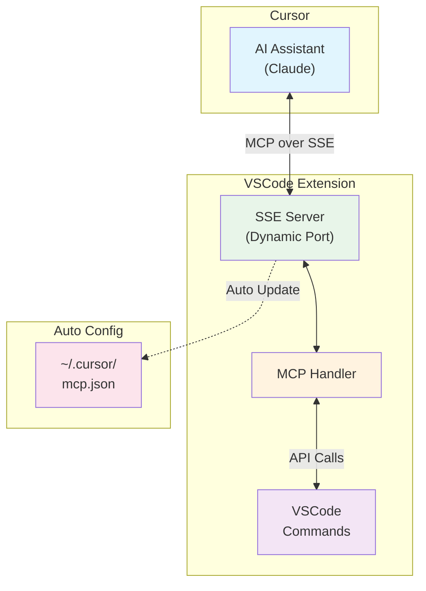
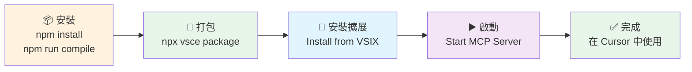

# MCP VSCode Commands Extension

一個允許 AI (如 Cursor 中的 Claude) 透過 **Model Context Protocol (MCP)** 直接執行 VSCode 命令的擴展。

## ✨ 主要功能

- 🔧 **執行 VSCode 命令**: 透過 MCP 執行任何 VSCode 內建或擴展命令
- 📋 **列出可用命令**: 動態獲取所有可用命令並支援過濾
- 🔄 **自動配置**: 自動設定 Cursor MCP 配置，無需手動操作
- 🎯 **動態端口**: 智能端口分配，避免衝突
- 🔒 **安全執行**: 完整錯誤處理和結果序列化
- ⚡ **SSE 連線**: 基於 Server-Sent Events 的現代化通訊

## 🏗️ 架構



### 🚀 工作流程

1. **VSCode 擴展啟動** → 自動分配可用端口啟動 SSE server
2. **自動配置** → 更新 `~/.cursor/mcp.json` 配置
3. **Cursor 連接** → 透過 SSE 連接到 MCP server
4. **執行命令** → AI 可直接使用 VSCode 命令工具

## 🛠️ MCP 工具

### `vscode.executeCommand`
執行指定的 VSCode 命令
- **參數**: `commandId` (必需), `args` (可選)
- **範例**: 格式化文件、開啟設定、保存檔案等

### `vscode.listCommands`  
列出所有可用的 VSCode 命令
- **參數**: `filter` (可選) - 過濾字串
- **回傳**: 過濾後的命令列表

## 📦 安裝與使用

### 🎯 快速開始



### 📋 詳細步驟

#### 1. 克隆並安裝依賴
```bash
git clone https://github.com/louisfghbvc/mcp-vscode-commands.git
cd mcp-vscode-commands
npm install
```

#### 2. 編譯和打包
```bash
# 編譯 TypeScript
npm run compile

# 打包擴展
npx vsce package
```

#### 3. 安裝到 VSCode/Cursor
- 開啟 VSCode 或 Cursor
- 前往擴展頁面 (`Ctrl/Cmd + Shift + X`)
- 點擊 "..." 選單 → "Install from VSIX..."
- 選擇生成的 `.vsix` 檔案

#### 4. 啟動 MCP Server
- 開啟命令面板 (`Ctrl/Cmd + Shift + P`)
- 執行: **`Start MCP Server`**
- 擴展會自動：
  - 🔍 尋找可用端口
  - 🚀 啟動 SSE server
  - ⚙️ 更新 `~/.cursor/mcp.json`
  - ✅ 顯示成功訊息

#### 5. 在 Cursor 中使用
- 重新啟動 Cursor
- AI 現在可以使用 VSCode 命令工具了！

## 💬 使用範例

### 自然語言指令
```
請幫我格式化當前文件
```

```
請列出所有編輯器相關的命令
```

```
請執行 workbench.action.openSettings 開啟設定
```

```
請新建一個終端
```

### 直接 MCP 工具調用

#### 列出編輯器相關命令
```json
{
  "name": "vscode.listCommands",
  "arguments": {
    "filter": "editor"
  }
}
```

#### 格式化當前文件
```json
{
  "name": "vscode.executeCommand",
  "arguments": {
    "commandId": "editor.action.formatDocument"
  }
}
```

#### 帶參數的命令執行
```json
{
  "name": "vscode.executeCommand",
  "arguments": {
    "commandId": "vscode.open",
    "args": ["file:///path/to/file.txt"]
  }
}
```

## ⚙️ 配置選項

在 VSCode 設定中配置：
- `mcpVscodeCommands.autoStart`: 自動啟動 MCP server (預設: true)
- `mcpVscodeCommands.logLevel`: 日誌級別 (預設: info)

## 📚 常用命令

### 📝 編輯器操作
- `editor.action.formatDocument` - 格式化文件
- `editor.action.organizeImports` - 整理 imports
- `editor.action.commentLine` - 切換註解
- `editor.action.duplicateSelection` - 複製選取內容

### 💾 檔案操作
- `workbench.action.files.save` - 保存當前檔案
- `workbench.action.files.saveAll` - 保存所有檔案
- `workbench.action.files.newUntitledFile` - 新建檔案

### 🔍 導航操作
- `workbench.action.quickOpen` - 快速開啟檔案
- `workbench.action.showCommands` - 顯示命令面板
- `workbench.action.gotoSymbol` - 跳到符號

### 🖥️ 終端操作
- `workbench.action.terminal.new` - 開啟新終端
- `workbench.action.terminal.toggleTerminal` - 切換終端

## 🧪 測試與調試

### 測試 SSE 連接
```bash
# 自動掃描並測試
node examples/test-sse-server.js

# 測試特定端口
node examples/test-sse-server.js 3000

# 掃描端口範圍
node examples/test-sse-server.js scan 3000 8000
```

### 檢查配置
```bash
# 查看 Cursor MCP 配置
cat ~/.cursor/mcp.json
```

### VSCode 開發者控制台
開啟 VSCode Developer Tools 查看詳細日誌。

## 🔧 擴展命令

- **`Start MCP Server`** - 啟動 MCP server 並自動配置
- **`Stop MCP Server`** - 停止 MCP server 並清理配置
- **`Show MCP Server Status`** - 顯示 server 狀態和 URL

## 📁 檔案結構

```
mcp-vscode-commands/
├── src/
│   ├── extension.ts          # VSCode 擴展主檔案
│   ├── mcp-sse-server.ts     # SSE-based MCP server
│   ├── types.ts              # TypeScript 類型定義
│   └── tools/                # MCP 工具實現
├── examples/
│   ├── README-MCP-Setup.md   # 詳細設定指南
│   ├── basic-usage.md        # 基本使用範例
│   ├── cursor-config.json    # Cursor 配置範例
│   └── test-sse-server.js    # SSE 測試工具
└── .github/workflows/        # GitHub Actions 自動化
```

## ❓ 故障排除

### Server 無法啟動
- 檢查 VSCode 開發者控制台的錯誤訊息
- 確保端口沒有被其他程序佔用
- 重新安裝擴展

### Cursor 無法連接
- 重新啟動 Cursor
- 檢查 `~/.cursor/mcp.json` 檔案是否正確
- 確認 MCP server 正在運行

### 命令執行失敗
- 確認命令 ID 是否正確
- 檢查命令是否需要特定的上下文
- 查看錯誤訊息獲取詳細資訊

## 🤝 貢獻

歡迎提交 Issues 和 Pull Requests！

## 📄 更多資源

- 📖 [詳細設定指南](./examples/README-MCP-Setup.md)
- 🛠️ [使用範例](./examples/basic-usage.md)
- 🌐 [MCP 官方文檔](https://modelcontextprotocol.io/)
- 📚 [VSCode Commands 參考](https://code.visualstudio.com/api/references/commands)

## 📝 授權

MIT License

---

**讓 AI 助手與 VSCode 完美協作！** 🚀✨