# MCP VSCode Commands Extension

A VSCode extension that allows LLMs to directly execute VSCode commands through the **Model Context Protocol (MCP)**.

## ✨ Features

- 🔧 **Execute VSCode Commands**: Run any VSCode built-in or extension commands via MCP
- 📋 **List Available Commands**: Dynamically retrieve all available commands with filtering support
- 🔒 **Safe Execution**: Complete error handling and result serialization
- 🚀 **Real-time Communication**: MCP protocol implementation over stdio

## 🏗️ Architecture

```mermaid
graph LR
    subgraph "Cursor"
        LLM["LLM<br/>(Claude)"]
    end
    
    Bridge["stdio ↔ WebSocket<br/>Bridge"]
    
    subgraph "VSCode"
        Extension["MCP Extension<br/>Port 3001"]
        Commands["VSCode<br/>Commands"]
    end
    
    LLM <-->|"MCP Protocol"| Bridge
    Bridge <-->|"WebSocket"| Extension
    Extension <-->|"API Calls"| Commands
    
    style LLM fill:#e1f5fe
    style Bridge fill:#fff3e0
    style Extension fill:#e8f5e9
    style Commands fill:#f3e5f5
```



### How it Works

1. **LLM in Cursor** sends MCP requests via stdio
2. **Bridge** converts stdio to WebSocket and forwards to VSCode
3. **MCP Extension** receives requests on port 3001
4. **Extension** executes VSCode commands and returns results
5. **Results** flow back through the same path

## 🛠️ MCP Tools

### `vscode.executeCommand`
Execute a specified VSCode command
- **Parameters**: `commandId` (required), `args` (optional)
- **Examples**: Format document, open settings, save files, etc.

### `vscode.listCommands`  
List all available VSCode commands
- **Parameters**: `filter` (optional) - Filter string
- **Returns**: Filtered list of commands

## 📦 Installation & Usage

### Quick Setup Flow

```mermaid
graph LR
    A["📦 Build<br/>npm run compile<br/>npx vsce package"] 
    B["⚙️ Install<br/>VSCode Extension<br/>from .vsix"]
    C["🔗 Configure<br/>Cursor MCP<br/>Auto or Manual"]
    D["✅ Ready<br/>Use in Cursor"]
    
    A --> B
    B --> C
    C --> D
    
    style A fill:#fff3e0
    style B fill:#e8f5e9
    style C fill:#e1f5fe
    style D fill:#f3e5f5
```



### Detailed Steps

#### 1. Install Dependencies
```bash
npm install
```

#### 2. Compile Project
```bash
npm run compile
```

#### 3. Package Extension
```bash
npx vsce package
# This creates mcp-vscode-commands-0.1.0.vsix
```

#### 4. Install Extension to VSCode
- Open VSCode
- Go to Extensions view (Ctrl/Cmd + Shift + X)
- Click "..." menu → "Install from VSIX..."
- Select the generated `.vsix` file

#### 5. Configure Cursor
**Option A: Automatic Setup (Recommended)**
- Open Command Palette in VSCode (Ctrl/Cmd + Shift + P)
- Run: `MCP VSCode Commands: Setup Cursor Config`
- Extension will automatically configure Cursor

**Option B: Manual Setup**
- Create/edit `~/.cursor/claude_desktop_config.json` (Linux/Mac) or `%APPDATA%\Cursor\claude_desktop_config.json` (Windows)
- Add the configuration from `examples/cursor-config.json`

#### 6. Start Using
- Restart Cursor to load the new MCP configuration
- The LLM can now use VSCode commands through MCP tools

## 🎯 Usage Examples

### List Editor-Related Commands
```json
{
  "name": "vscode.listCommands",
  "arguments": {
    "filter": "editor"
  }
}
```

### Format Current Document
```json
{
  "name": "vscode.executeCommand",
  "arguments": {
    "commandId": "editor.action.formatDocument"
  }
}
```

### Open Settings Page
```json
{
  "name": "vscode.executeCommand", 
  "arguments": {
    "commandId": "workbench.action.openSettings"
  }
}
```

### Execute Command with Arguments
```json
{
  "name": "vscode.executeCommand",
  "arguments": {
    "commandId": "vscode.open",
    "args": ["file:///path/to/file.txt"]
  }
}
```

## 🔧 Configuration Options

Configure in VSCode settings:
- `mcpVscodeCommands.autoStart`: Auto-start MCP server (default: true)
- `mcpVscodeCommands.logLevel`: Log level (default: info)

## 📚 Common Commands

### Editor Operations
- `editor.action.formatDocument` - Format current document
- `editor.action.organizeImports` - Organize imports
- `editor.action.commentLine` - Comment/uncomment lines
- `editor.action.duplicateSelection` - Duplicate selection

### Workspace Operations
- `workbench.action.files.save` - Save current file
- `workbench.action.files.saveAll` - Save all files
- `workbench.action.closeActiveEditor` - Close current editor
- `workbench.action.openSettings` - Open settings

### Navigation Operations
- `workbench.action.quickOpen` - Quick open files
- `workbench.action.showCommands` - Show command palette
- `workbench.action.gotoSymbol` - Go to symbol

### Terminal Operations
- `workbench.action.terminal.new` - Open new terminal
- `workbench.action.terminal.toggleTerminal` - Toggle terminal

## ⚠️ Error Handling

If a command execution fails, an error message is returned:

```json
{
  "content": [{
    "type": "text", 
    "text": "❌ Error: Command 'invalid.command' does not exist"
  }],
  "isError": true
}
```

## 📖 More Examples

For detailed usage examples, see [examples/basic-usage.md](./examples/basic-usage.md)

## 🏗️ Development

See [PROJECT_PLAN.md](./docs/archive/PROJECT_PLAN.md) for development plan and architecture design.

## 🐛 Debugging

Check VSCode Developer Tools console for detailed logging information.

## 📝 License

MIT License